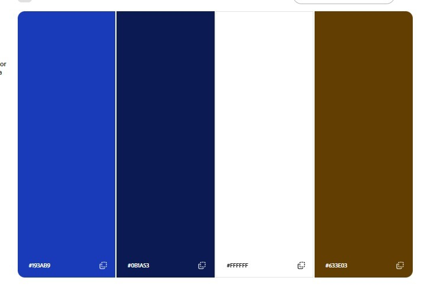
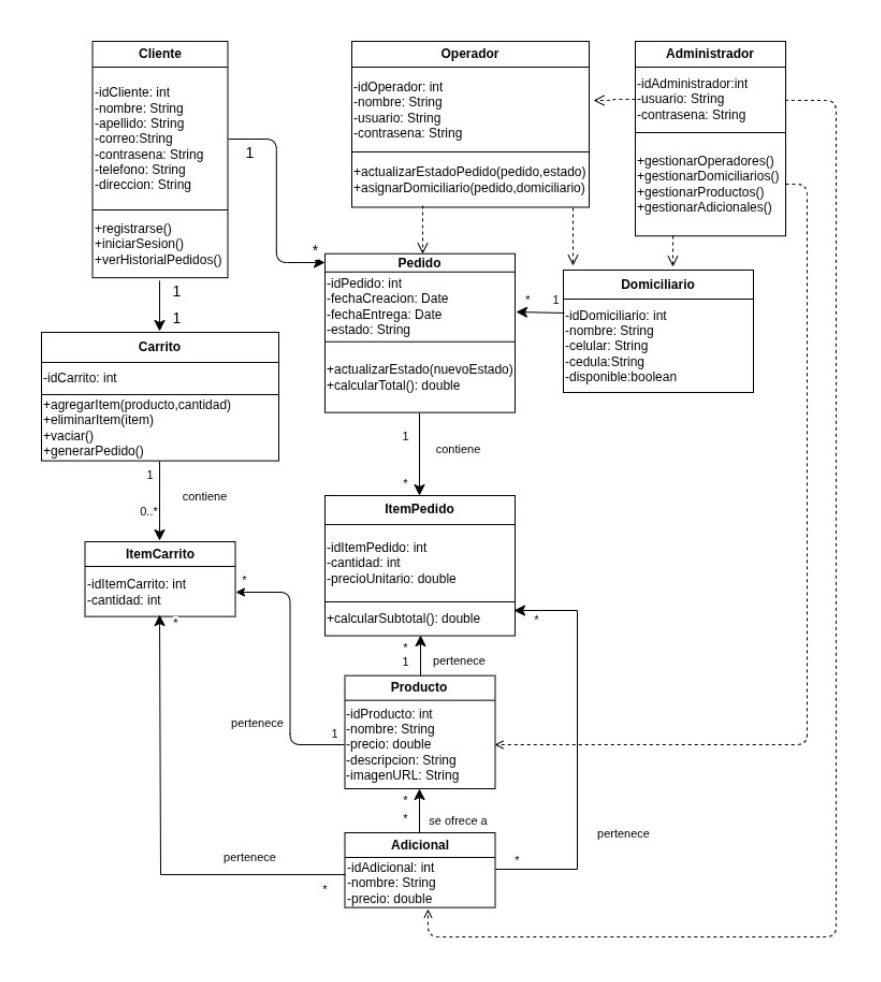
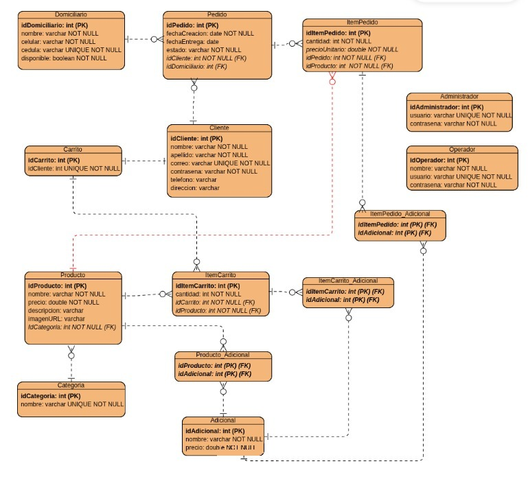

# 🦀 El Crustáceo Caribeño — Plataforma Web Gastronómica

Bienvenido al repositorio oficial del proyecto **Crustáceo Caribeño**, una plataforma web integral desarrollada para un restaurante especializado en gastronomía marina tradicional y sabores auténticos de las costas del Caribe (mariscos frescos, pescados a la brasa, ceviches, cazuelas y arroces marineros).

La solución permite a los clientes explorar el menú gastronómico por categorías o en tabla detallada, gestionar su perfil, consultar el detalle y acompañamientos de cada plato, y proporciona la base arquitectónica para la gestión de comandas y pedidos a domicilio.

---

## 📋 Tabla de Contenido
- [🌊 Visión General](#-visión-general)
- [🎨 Identidad Visual y Paleta de Colores](#-identidad-visual-y-paleta-de-colores)
- [📐 Arquitectura y Modelado del Dominio](#-arquitectura-y-modelado-del-dominio)
  - [Diagrama de Clases (UML)](#diagrama-de-clases-uml)
  - [Diagrama Entidad–Relación (DER)](#diagrama-entidadrelación-der)
- [📁 Estructura del Proyecto](#-estructura-del-proyecto)
- [🛠️ Tecnologías y Dependencias](#️-tecnologías-y-dependencias)
- [🚀 Puesta en Marcha (Cómo Ejecutar)](#-puesta-en-marcha-cómo-ejecutar)
- [🗄️ Base de Datos H2 y DataLoader](#️-base-de-datos-h2-y-dataloader)
- [🛡️ Manejo Centralizado de Errores](#️-manejo-centralizado-de-errores)
- [👥 Equipo de Desarrollo](#-equipo-de-desarrollo)

---

## 🌊 Visión General

El restaurante cuenta con una sede física y alta demanda de pedidos. Esta plataforma digitaliza el catálogo gastronómico y la atención al cliente mediante:
- **Catálogo interactivo de platos:** Visualización agrupada por categorías (Entradas, Platos Fuertes, Especialidades, Postres, Bebidas) y en formato tabular con acciones CRUD.
- **Detalle de producto y acompañamientos:** Visualización detallada de ingredientes, categoría y opciones adicionales.
- **Gestión de clientes y perfil:** Registro, inicio de sesión y edición de datos del perfil con propagación limpia de estado por URL.
- **Persistencia relacional:** Migración completa a **Spring Data JPA** sobre base de datos **H2** en archivo.

---

## 🎨 Identidad Visual y Paleta de Colores

La identidad visual del proyecto evoca la frescura marina, elegancia y calidez caribeña:



| Color | Código HEX | Rol / Uso en la Interfaz |
|---|:---:|---|
| **Azul Caribe** | `#193AB9` | Botones de acción principal, acentos y llamados a la acción (CTA). |
| **Azul Marino Profundo** | `#0B1A53` | Barra de navegación (Navbar), pie de página (Footer) y encabezados. |
| **Blanco Nieve** | `#FFFFFF` | Fondos de tarjetas, paneles de formulario y legibilidad general. |
| **Café Náutico / Dorado** | `#633E03` | Detalles cálidos, líneas divisorias decorativas y estados secundarios. |

---

## 📐 Arquitectura y Modelado del Dominio

El sistema se modeló bajo principios de arquitectura limpia, separación de responsabilidades y diseño orientado a objetos sin herencia en entidades del dominio.

### Diagrama de Clases (UML)
Representa la estructura estática del sistema, sus clases de dominio, atributos, operaciones y multiplicidades:



### Diagrama Entidad–Relación (DER)
Representa el modelo relacional físico, llaves primarias (`PK`), foráneas (`FK`), restricciones de nulidad y unicidad:



#### Entidades Principales Persistidas con Spring Data JPA:
1. **`Cliente`**: Identificador único autoincremental (`idCliente`), nombre, apellido, correo único, contraseña, teléfono y dirección.
2. **`Categoria`**: Categorías del menú (`idCategoria`, `nombre` único), con relación `@OneToMany` hacia productos y borrado en cascada.
3. **`Producto`**: Plato o bebida (`idProducto`, `nombre`, `precio`, `descripcion`, `imagenURL`), asociado mediante `@ManyToOne` a su correspondiente `Categoria`.

---

## 📁 Estructura del Proyecto

El proyecto sigue una arquitectura multicapa desacoplada:

```text
CrustaceoCaribeno-WebProject/
├── demo/                                # Módulo de la aplicación Spring Boot
│   ├── src/main/java/com/example/demo/
│   │   ├── controller/                  # Controladores Spring MVC (@Controller)
│   │   │   ├── HomeController.java      # Enrutamiento de la Landing Page (/home)
│   │   │   ├── ProductoController.java  # Catálogo en tarjetas, tabla, detalle y CRUD
│   │   │   ├── LoginController.java     # Autenticación y registro de clientes
│   │   │   └── PerfilController.java    # Consulta y edición del perfil de cliente
│   │   │
│   │   ├── entitys/                     # Entidades de dominio mapeadas con JPA (@Entity)
│   │   │   ├── Categoria.java           # Categoría de platos (@OneToMany)
│   │   │   ├── Cliente.java             # Entidad Cliente con restricciones DDL
│   │   │   └── Producto.java            # Entidad Producto con relación @ManyToOne
│   │   │
│   │   ├── errors/                      # Manejo global de excepciones (@ControllerAdvice)
│   │   │   ├── GlobalExceptionHandler.java
│   │   │   ├── ClienteAlreadyExistsException.java
│   │   │   ├── ClienteNotFoundException.java
│   │   │   └── ProductoNotFoundException.java
│   │   │
│   │   ├── repository/                  # Repositorios Spring Data JPA (JpaRepository)
│   │   │   ├── CategoriaFakeRepository.java
│   │   │   ├── ClienteFakeRepository.java
│   │   │   └── ProductoFakeRepository.java
│   │   │
│   │   ├── service/                     # Capa de lógica de negocio desacoplada
│   │   │   ├── CategoriaService.java / CategoriaServiceImpl.java
│   │   │   ├── ClienteService.java / ClienteServiceImpl.java
│   │   │   └── ProductoService.java / ProductoServiceImpl.java
│   │   │
│   │   ├── DataLoader.java              # Carga inicial de datos al arranque (CommandLineRunner)
│   │   └── DemoApplication.java         # Punto de entrada de la aplicación Spring Boot
│   │
│   └── src/main/resources/
│       ├── static/                      # Recursos estáticos web
│       │   ├── css/                     # Hojas de estilo modulares (general, tarjetas, tabla, detalle, etc.)
│       │   ├── js/                      # Interactividad y scripts del frontend
│       │   └── images/                  # Activos gráficos, logos y fotografías de platos
│       ├── templates/                   # Plantillas dinámicas Thymeleaf
│       │   ├── home.html                # Landing Page
│       │   ├── login.html               # Formulario de login
│       │   ├── registro.html            # Formulario de registro
│       │   ├── perfil.html              # Vista y edición de perfil de cliente
│       │   ├── comidas-tarjetas.html    # Catálogo visual por categorías (tarjetas)
│       │   ├── comidas-tabla.html       # Catálogo tabular con acciones CRUD
│       │   ├── comida-detalle.html      # Detalle del plato con categoría visible y adicionales
│       │   ├── comida-agregar.html      # Formulario para agregar / editar plato con selector de categoría
│       │   └── error.html               # Pantalla amigable para captura de errores
│       └── application.properties       # Configuración de H2, JPA, Hibernate y servidor
│
├── images/                              # Diagramas de modelado y paleta de colores
│   ├── diagrama-clases.jpg
│   ├── diagrama-entidad-relacion.jpg
│   └── paleta-colores.jpg
│
└── pom.xml                              # Configuración Maven y dependencias del ecosistema Spring
```

---

## 🛠️ Tecnologías y Dependencias

- **Java 17 (LTS)**
- **Spring Boot 3.x:**
  - `spring-boot-starter-web`: Creación de API y controladores MVC.
  - `spring-boot-starter-thymeleaf`: Renderizado del lado del servidor.
  - `spring-boot-starter-data-jpa`: Persistencia ORM con Hibernate.
- **H2 Database Engine:** Base de datos relacional ligera persistida en disco (`file:./mydatabase`).
- **Lombok:** Generación de `@Getter`, `@Setter`, `@ToString` y `@Builder`.
- **Frontend:** HTML5 semántico, CSS3 modular, Bootstrap Icons y fuentes tipográficas Google Fonts (*Playfair Display* y *Poppins*).

---

## 🚀 Puesta en Marcha (Cómo Ejecutar)

### Prerrequisitos
- Tener instalado **Java JDK 17** o superior.
- Git instalado.

### Pasos de ejecución:
1. Clonar el repositorio y situarse en la carpeta `demo`:
   ```bash
   cd demo
   ```
2. Ejecutar la aplicación con el Maven Wrapper:
   - **En Windows (CMD o PowerShell):**
     ```cmd
     .\mvnw.cmd spring-boot:run
     ```
   - **En Linux / macOS:**
     ```bash
     ./mvnw spring-boot:run
     ```
3. Abrir el navegador en:
   ```text
   http://localhost:8080/home
   ```

---

## 🗄️ Base de Datos H2 y DataLoader

### Carga Automática de Datos (`DataLoader`)
Al arrancar la aplicación, el componente `DataLoader` puebla automáticamente la base de datos con:
- **10 Clientes registrados:**
  - Ejemplo: Correo `Juan.Rodriguez@gmail.com` | Contraseña `1234`
  - Ejemplo: Correo `maria.gomez@gmail.com` | Contraseña `5678`
- **5 Categorías:** Entrada, Plato Fuerte, Especialidad de la Casa, Postre, Bebida.
- **43+ Productos (Platillos y Bebidas):** Con nombres reales, precios en COP, descripciones gourmet y URLs de imágenes representativas, vinculados relacionalmente a su respectiva categoría.

### Consola de Administración H2
Es posible inspeccionar las tablas relacionales y ejecutar consultas SQL desde el navegador:
- **URL de acceso:** `http://localhost:8080/h2`
- **Driver Class:** `org.h2.Driver`
- **JDBC URL:** `jdbc:h2:file:./mydatabase`
- **User Name:** `sa`
- **Password:** *(dejar vacío)*

---

## 🛡️ Manejo Centralizado de Errores

El proyecto cuenta con un controlador de asesoría global (`@ControllerAdvice`) en [GlobalExceptionHandler.java](demo/src/main/java/com/example/demo/errors/GlobalExceptionHandler.java):
- **Producto no encontrado:** Al intentar consultar `/comidas/detalle/{id}` con un ID inexistente, se dispara `ProductoNotFoundException` y se despliega una vista amigable `error.html` con mensaje claro y botón de retorno.
- **Cliente no encontrado / Correo ya registrado:** Se capturan `ClienteNotFoundException` y `ClienteAlreadyExistsException` protegiendo las reglas del negocio.
- **Excepciones generales:** Se capturan fallos inesperados previniendo pantallas de error genéricas.

---

## 👥 Equipo de Desarrollo

Proyecto desarrollado para la asignatura de **Desarrollo Web** — Pontificia Universidad Javeriana:

- **Sebastián Gaibor**
- **Dana Trujillo**
- **Santiago Cano**
- **Andrés Díaz**

---
*© 2026 El Crustáceo Caribeño. Todos los derechos reservados.*
